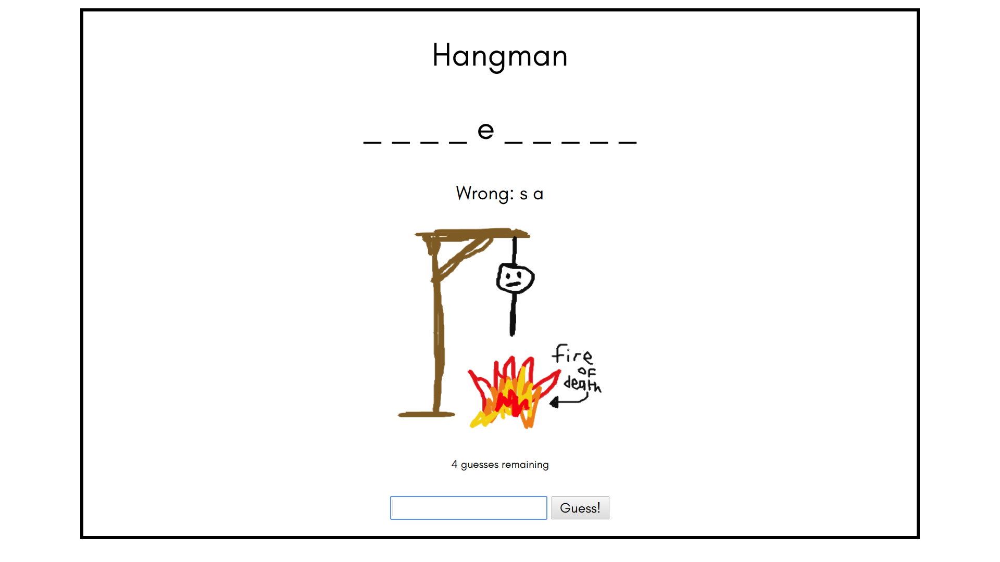
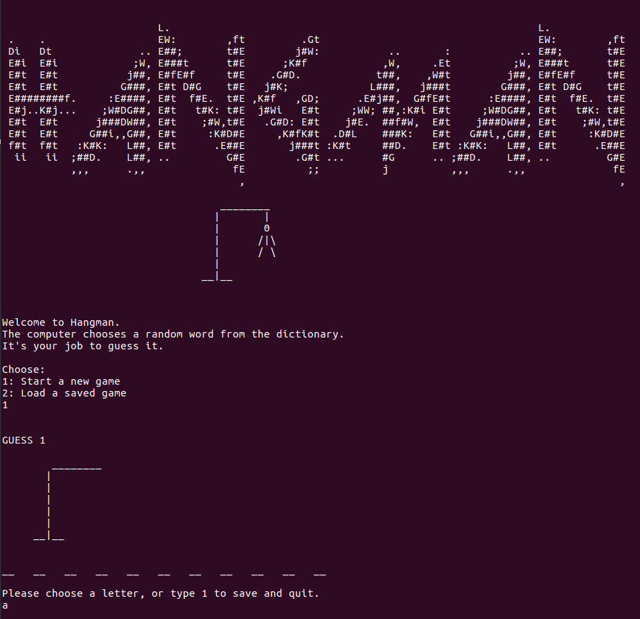

# Hangman

This is player vs computer game of [Hangman](https://en.wikipedia.org/wiki/Hangman_(game)) for the browser and Terminal. It chooses a random word of between 5 and 12 letters from the dictionary, which the player has 6 turns to guess.

The project began life as a pure Ruby program to play in Terminal, and then a followup project used Sinatra to create a webapp, which you can play [here](https://blooming-coast-46970.herokuapp.com/).

Skills practiced:

Web app:
 - Creating a dynamic web app with Sinatra.
 - Using sessions to persist data across http requests.
 - Using route handlers to respond to POST and GET requests.

 Terminal:
 - File serialization using YAML to save and load game progress.
 - String manipulation.
 - Object-Oriented Programming to create a working game.




It's a project from [The Odin Project](https://www.theodinproject.com/courses/ruby-programming/lessons/advanced-building-blocks).

I developed most of the web app together with fellow Odinite IvyMic.

## Installation

Open your terminal/command line. Navigate to the directory where you want this project to live. Type:
```
$ git clone https://github.com/Jonosenior/hangman.git
$ cd hangman/lib
$ ruby hangman.rb
```

## Post-project thoughts

The process of learning a framework like Sinatra is fundamentally different from learning a language like Ruby, because you're learning conventions rather than fundamentals. For example, I had problems when adding my pictures to the HTML, because my relative filepath - src="../public/image.jpg" - wasn't working. It took an answer from the Odin Project Gitter to teach me that Sinatra automatically looks for static content in a folder named public/, so my filepath was messing it up.

The terminal game itself was relatively straightforward to build, and I finished it in an afternoon.

Developing the save/load functions was harder, and the challenge pushed me to learn more about YAML and data serialization.

# Todo

  - Create an AI which could guess a word inputted by the player. The strategy would look something like:
    - Use a list of the most frequent letters in the English language for the first few guesses: ( e-t-a-o-i-n-s-h-r-d-l-u ).
    - Iterate through a dictionary file and remove those words which are incompatible with the currently-known correct and incorrect letters and letter positions.
